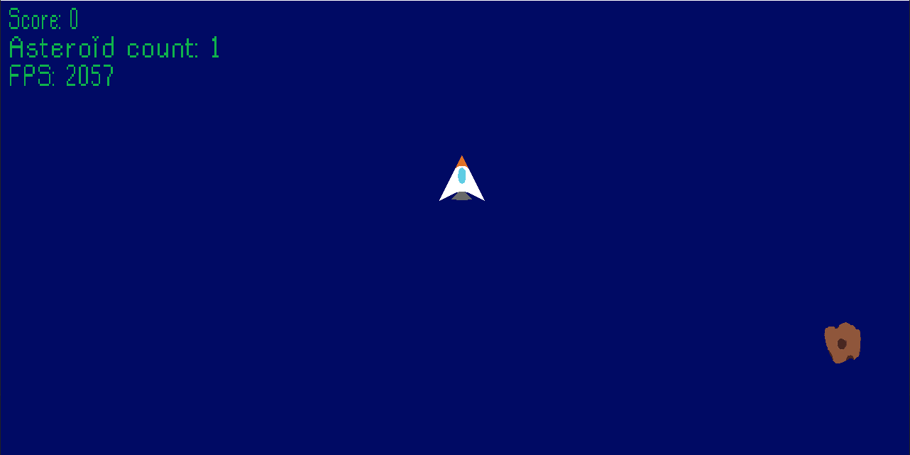
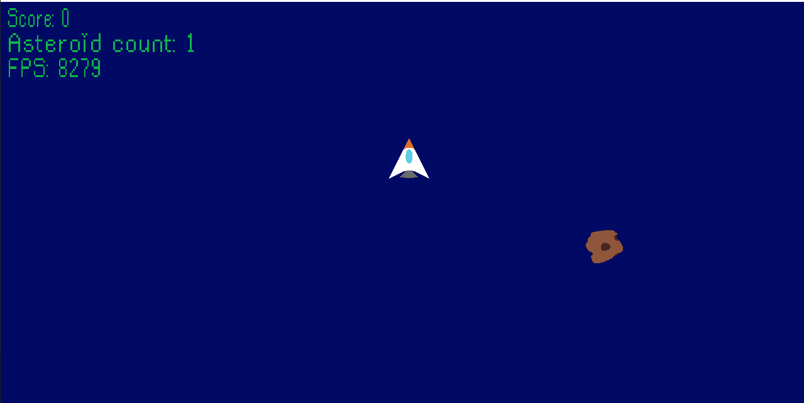
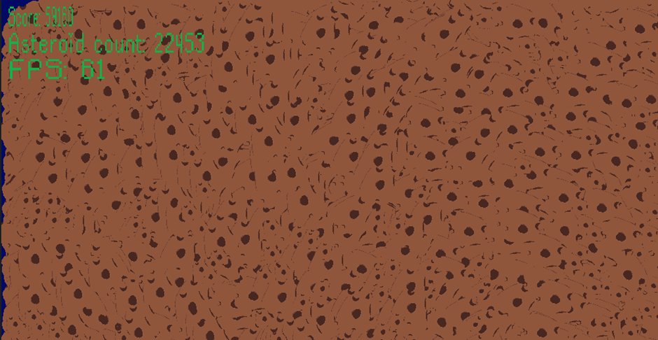

# asteroid-game

This project was done in Rust lang using the SDL2 library for rendering. I also used the specs and specs-derive crates for ECS.

I decided to separate the physics loop from the actual frame rate later in the project to not have to artificially slow the program down using thread.sleep. This increased the fps to about 2000 from being capped at 60. After that I decided to change how I made the UI, initially I just created a new object every frame which caused a lot of unnecessary work for the CPU since it had to load the texture every time. I changed the code to update UI only when the value being displayed had changed. Because of the FPS display this is still done once per second though.

# Before changing texture creation to only happen when needed.

# After changing texture creation.

# Hits 60 fps with over 20000 asteroids on screen.

